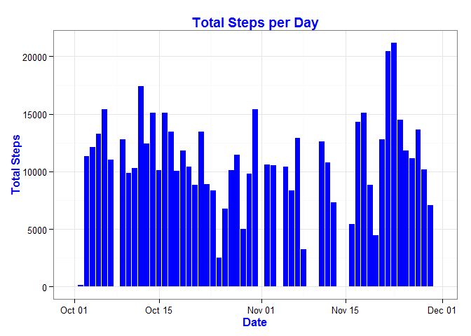
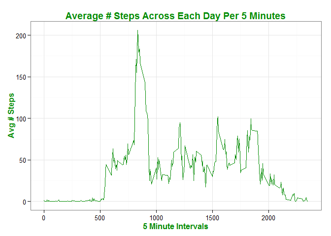

# Reproducible Research: Peer Assessment 1

This is Peer Assessment 1 from the Reproducible Research class in the Data Scientist Specialization 
course.  The data used in this assignment are contained in this repository.  The code used to access
and manipulate this data to answer the assignment questions are documented in this markdown file.  
Away we go.


###<font color=red>Loading and preprocessing the data </font>

<font color=red>Loading data</font>

```r
data <- read.csv("activity.csv", stringsAsFactors=FALSE)
```

<font color=red>Preprocessing data</font>

```r
#Load Libraries
library(plyr)
library(dplyr)
library(ggplot2)
```


```r
#Turn dates from character string into POSIX class for sortability reasons.
data$date <- as.POSIXct(data$date, format = "%Y-%m-%d")
#Turn data into tbl_df
data <- tbl_df(data)
#Sums total steps per day
steps <- ddply(data, .(date), summarize, steps = sum(steps, na.rm=TRUE))
```


### <font color=blue> What is mean total number of steps taken per day? </font>

<font color=blue> Histogram of the total number of steps taken each day </font>

```r
ggplot(steps, aes(date, steps)) + geom_histogram(stat="identity", fill = "blue") + theme_bw() + labs(title="Total Steps per Day", x = "Date", y = "Total Steps") + theme(title = element_text(face="bold", color="blue"), axis.title.x = element_text(face="bold", color="blue"), axis.title.y = element_text(face="bold", color="blue"))
```

 

<font color=blue> Calculate and report the *mean* and *median* total number of steps taken per day.</font>

```r
mean <- mean(steps$steps)
median <- median(steps$steps)
mean <- as.integer(mean)
median <- as.integer(median)
```

**<font color=blue>
The mean number of steps taken each day is 9354.  
The median number of steps taken each day is 10395. 
</font>**


### <font color = green>What is the average daily activity pattern?</font>

<font color = green> Time series plot of the 5-minute interval (x-axis) and the average number of steps taken, averaged across all days (y-axis). </font>

```r
intervals <- ddply(data, .(interval), summarize, steps = sum(steps, na.rm=TRUE))
ggplot(intervals, aes(interval, steps)) + geom_line(stat = "identity", color ="green4") + theme_bw() + labs(title = "Average # Steps Across Each Day Per 5 Minutes", x="5 Minute Intervals", y="Avg # Steps") + theme(title = element_text(face="bold", color="green4"), axis.title.x = element_text(face="bold", color="green4"), axis.title.y = element_text(face="bold", color="green4"))
```

 

<font color = green> Which 5-minute interval, on average across all the days in the dataset, contains the maximum number of steps? </font>

```r
intervals <- arrange(intervals, desc(steps))
```

**<font color=green>835 is the 5-minute interval which contains the maximum number of steps. </font>**

### Imputing missing values


### Are there differences in activity patterns between weekdays and weekends?


#Set1: red,blue, green, purple, orange, yellow, brown, pink, grey
